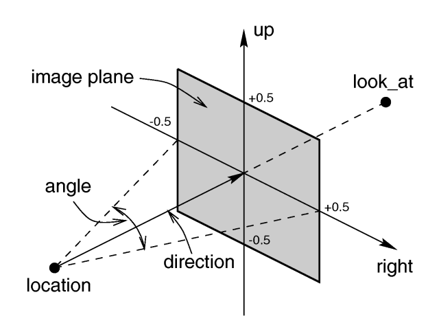
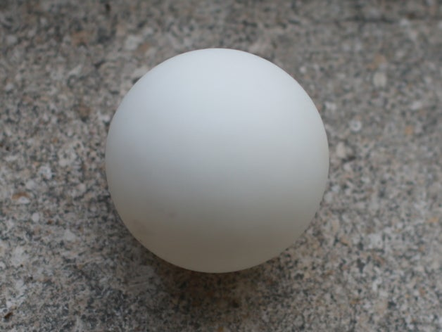
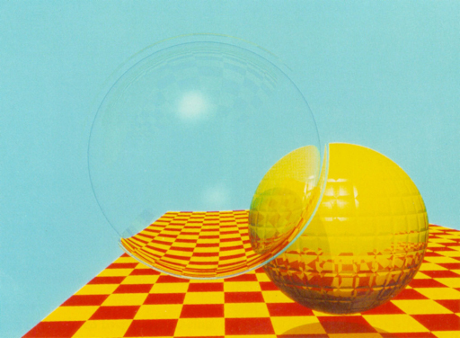

title: Ray Tracing
author:
  name: Amy K
  url: https://github.com/amy-keibler/raytracing_presentation
theme: sudodoki/reveal-cleaver-theme
output: raytracing.html

--

# Ray Tracing
## Building a Simple Ray Tracer

--

### Prerequisites

* A shell of a program that can set the color of each pixel on an image
* A vector library or your own implementation of would be useful (dot products, cross products, normalization, etc.)
* Openness to doing vector math in exchange for nifty images

--

### Plan

* Explain ray tracing at a high level
* Cameras
* Surfaces
* Intersection
* Light Models
  * Lambertian
  * Phong
  * Whitted

--

### High Level

* Simulation of light in a scene
  * Shadows, indirect lighting, and other effects
* Ray tracing v. path tracing

--

### Cameras

[[POV Ray](https://wiki.povray.org/content/Reference:Camera)]

--

### Surfaces

* Material
  * Color
  * Reflective / Refractive Properties
* Defined Intersection Equation

--

### Intersection

* Closest Intersection of Ray with Surface
* Intersections between Point and Light for shadows

--

### Light

* Ambient light
* Diffuse light
* Specular light

--

### Lambertian Illumination Model

[[Thingiverse](https://www.thingiverse.com/thing:961955)]

--

### Lambertian Continued

[[Wikipedia](https://en.m.wikipedia.org/wiki/Lambertian_reflectance)]

---

### Phong Illumination Model

[[Wikipedia](https://en.m.wikipedia.org/wiki/File:Phong_components_version_4.png)]

--

### Phong Continued

[[Wikipedia](https://en.m.wikipedia.org/wiki/Phong_reflection_model#Description)]

--

### Whitted Model

[[SIGGRAPH](https://digitalartarchive.siggraph.org/artwork/turner-whitted-untitled-ray-traced-spheres/)]

--

### Whitted Continued

* Inspired by Lambertian & Phong models
  * Adds reflection to more accurately capture specular highlights
  * Adds refraction to represent additional effects

--

### Fun Extensions

* Anti-aliasing
* Add textures to surfaces
* Refraction
* Triangle Meshes + 3D modeling software
* Alternative Illumination Physics (Toon Shading)
* Animation
* 360 degree camera

--

### Other Resources

* [Original Whitted Paper (PDF)](https://www.cs.drexel.edu/~david/Classes/CS586/Papers/p343-whitted.pdf)
* [Ray Tracing in One Weekend](https://raytracing.github.io/)
* [Graphics & Visualization Book](http://graphics.cs.aueb.gr/cgvizbook/index.html)
